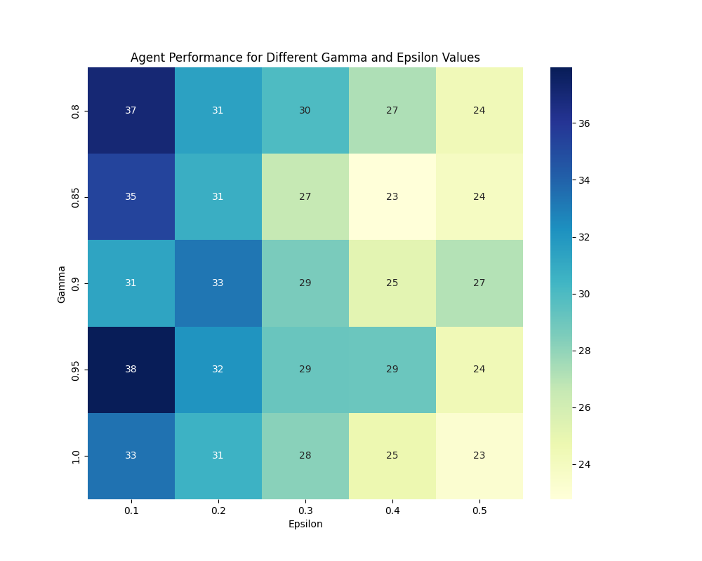
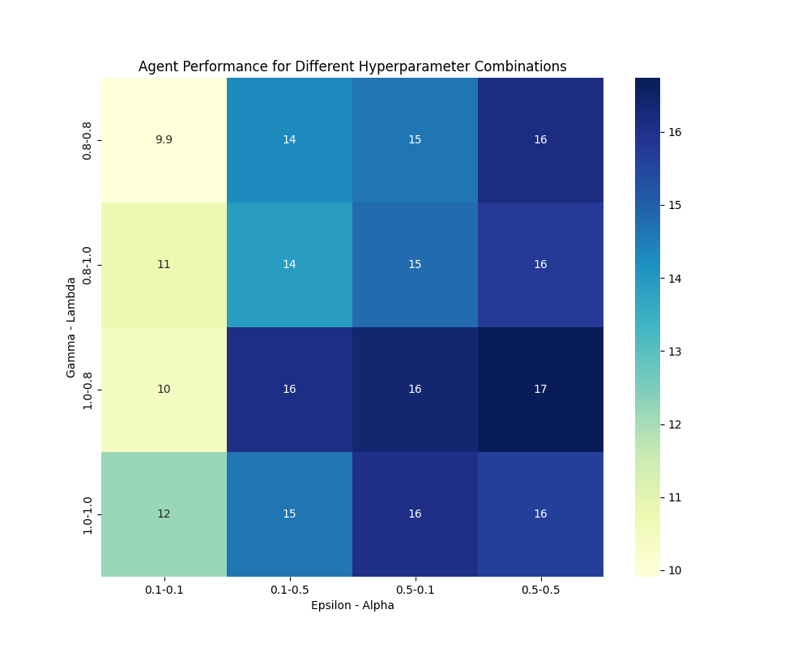
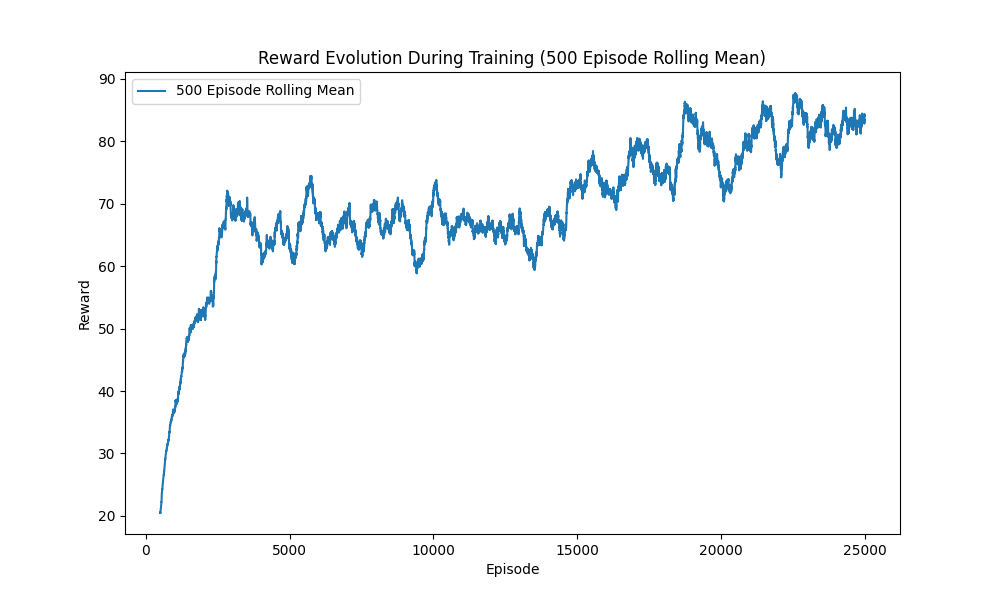
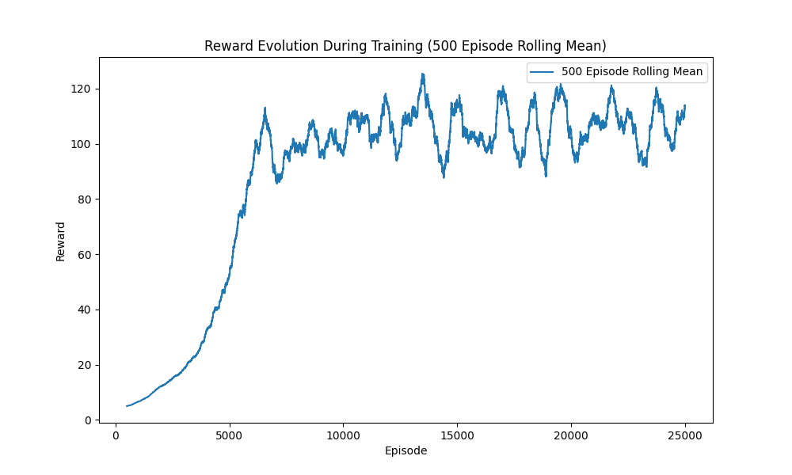
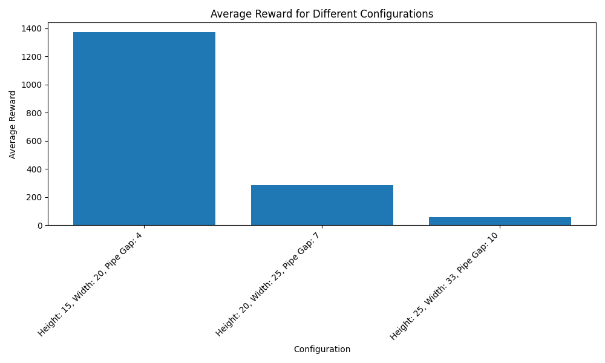

# Reinforcement Learning Assignment: Text Flappy Bird Analysis

## Author
Romain Mondelice

## Introduction
This project focuses on applying reinforcement learning techniques to a variation of the classic game Flappy Bird, termed as Text Flappy Bird (TFB). The primary goal was to implement and evaluate two distinct reinforcement learning agents - a Monte Carlo-based agent and a Sarsa(λ) agent - across different environments and configurations to understand their behaviors, strengths, and limitations.

## Environments
Two versions of the Text Flappy Bird environment were explored:
- **TextFlappyBird-screen-v0**: Provides the complete screen render of the game as the observation.
- **TextFlappyBird-v0**: Provides the distance of the player from the center of the closest upcoming pipe gap along the two axes (x, y) as the observation.

## Implementation
### Agents
1. **Monte Carlo Agent**: An agent based on the Monte Carlo method was implemented to interact with the TFB environment. The agent's strategy, design, and hyperparameters are discussed in detail within the project.
2. **Sarsa(λ) Agent**: Following the guidelines from the Reinforcement Learning Book, a Sarsa(λ) agent was developed. This section elaborates on the agent's implementation, the choice of λ, and other relevant details.

### Sensitivity Analysis
A comprehensive sensitivity analysis was conducted to identify the best hyperparameters for both agents. This analysis aimed at optimizing performance while assessing the agents' sensitivity to various parameter settings.

  
  

  
  

*Figure 1: Sensitivity Analysis Graphs*
Respectively: sensitivity_analysis_mc_screen, sensitivity_analysis_mc_dist, sensitivity_analysis_sarsa_screen, sensitivity_analysis_sarsa_dist

## Experiments and Results
Once we have found the best set of hyper-parameters, we trained the model for 25k episodes for each model and each type of environment.

  
  

  
  

*Figure 2: Rewards mean evolution over training*
Respectively: reward_evolution_rolling_mean_mc_screen, reward_evolution_rolling_mean_mc_dist, reward_evolution_rolling_mean_sarsa_screen, reward_evolution_rolling_mean_sarsa_dist

### Overfitting Test
An additional set of experiments was conducted to examine how well the agents adapted to different settings of the environment, such as varying heights, widths, and pipe gaps. This test was crucial for understanding the models' generalization capabilities and their susceptibility to overfitting.

  
  

  
  

*Figure 3: Reward Evolution for Each Configuration*
Respectively: average_reward_histogram_mc_screen, average_reward_histogram_mc_dist, average_reward_histogram_sarsa_screen, average_reward_histogram_sarsa_dist

## Discussion
The sensitivity analysis enabled us to identify the optimal combination of hyperparameters. Extending the training duration could potentially allow for even more precise determination of the best hyperparameters. However, the selected parameters have already demonstrated considerable effectiveness, as evidenced by the evolution and final rewards obtained during testing.

It is evident that all models are capable of learning. However, there is a significant discrepancy in the rewards between the "TextFlappyBird-screen-v0" environment and the "TextFlappyBird-v0" environment, which is based on distance measurements.

The "TextFlappyBird-v0" environment demonstrates quicker convergence and achieves substantially higher average rewards in the trained configuration.

Regarding overfitting, it is observed that all models struggle to generalize behavior and achieve scores comparable to those in the trained configuration. This indicates a potential area for improvement in enhancing the models' ability to adapt to new or varied environments without significant loss in performance.

## Conclusion
This project offers valuable insights into the application of reinforcement learning techniques to the Text Flappy Bird (TFB) game. It highlights the effectiveness of the implemented agents and underscores the importance of selecting appropriate hyperparameters and environment. While the models show promising results in learning, there is still a big challenge of overfitting and generalization point.

One thing that I found very interesting that we can do to bring this generalization, is to combine the reward with an A* heuristic.