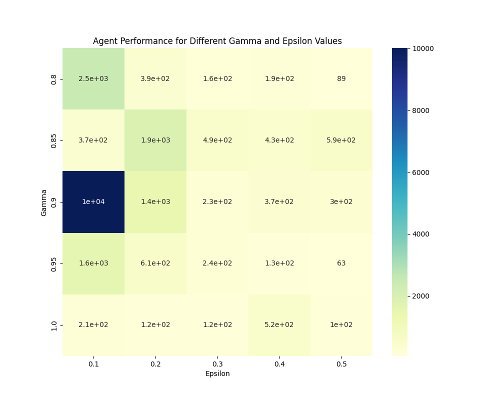
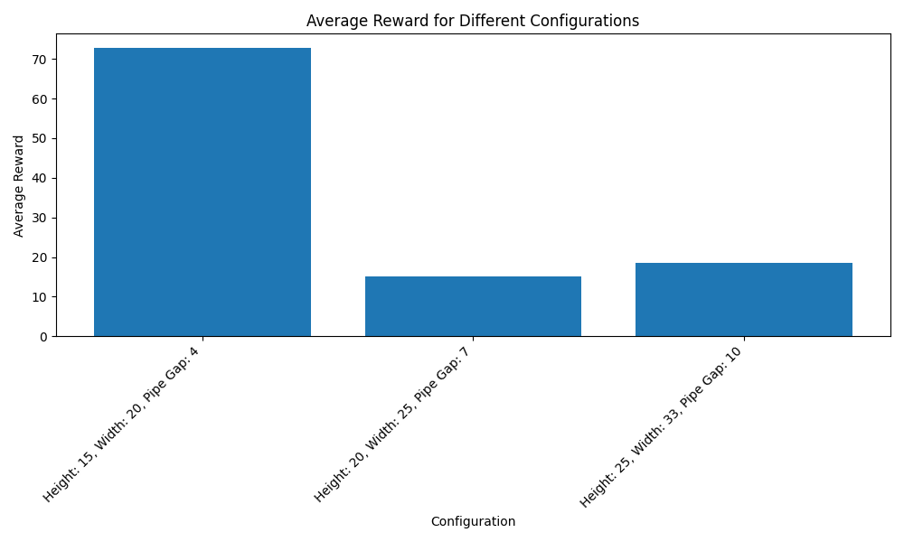
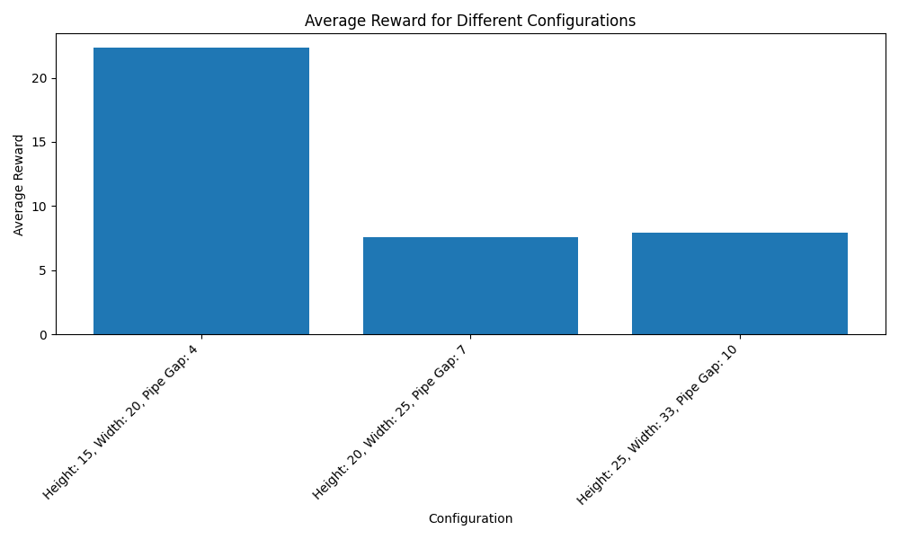
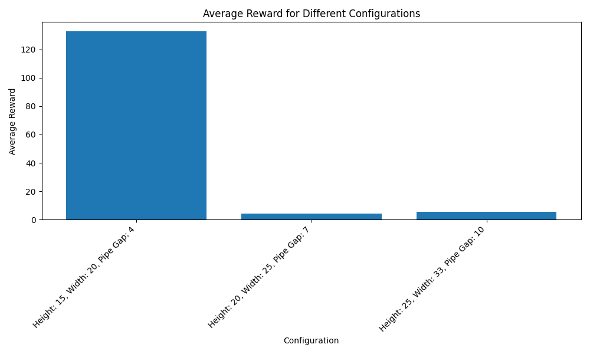

# Reinforcement Learning Assignment: Text Flappy Bird Analysis

## Author
Romain Mondelice

## Introduction
This project focuses on applying reinforcement learning techniques to a variation of the classic game Flappy Bird, termed as Text Flappy Bird (TFB). The primary goal was to implement and evaluate two distinct reinforcement learning agents - a Monte Carlo-based agent and a Sarsa(λ) agent - across different environments and configurations to understand their behaviors, strengths, and limitations.

## Environments
Two versions of the Text Flappy Bird environment were explored:
- **TextFlappyBird-screen-v0**: Provides the complete screen render of the game as the observation.
- **TextFlappyBird-v0**: Provides the distance of the player from the center of the closest upcoming pipe gap along the two axes (x, y) as the observation.

## Implementation
### Agents
1. **Monte Carlo Agent**: An agent based on the Monte Carlo method was implemented to interact with the TFB environment. The agent's strategy, design, and hyperparameters are discussed in detail within the project.
2. **Sarsa(λ) Agent**: Following the guidelines from the Reinforcement Learning Book, a Sarsa(λ) agent was developed. This section elaborates on the agent's implementation, the choice of λ, and other relevant details.

### Sensitivity Analysis
A comprehensive sensitivity analysis was conducted to identify the best hyperparameters for both agents. This analysis aimed at optimizing performance while assessing the agents' sensitivity to various parameter settings.

  
  

  
  

*-- Figure 1: Sensitivity Analysis Graphs --*

## Experiments and Results
Once we have found the best set of hyper-parameters, we trained the model for 25k episodes for each model and each type of environment.

  
  

  
  

*-- Figure 2: Rewards mean evolution over training --*

### Overfitting Test
An additional set of experiments was conducted to examine how well the agents adapted to different settings of the environment, such as varying heights, widths, and pipe gaps. This test was crucial for understanding the models' generalization capabilities and their susceptibility to overfitting.

  
  

  
  

*-- Figure 3: Reward Evolution for Each Configuration --*

## Discussion
The findings from the experiments are discussed, highlighting the agents' performance, the impact of hyperparameter settings, and their generalization abilities. Insights drawn from the sensitivity analysis and the challenges encountered during the implementation are also shared.

## Conclusion
The project concludes with reflections on the reinforcement learning techniques applied to the TFB game, the effectiveness of the implemented agents, and potential areas for future research.

## How to Use This Repository
- **Environment Setup**: Instructions for setting up the Text Flappy Bird environments.
- **Running the Agents**: Guidelines on how to execute the Monte Carlo and Sarsa(λ) agents, including how to conduct the sensitivity analysis and interpret the results.
